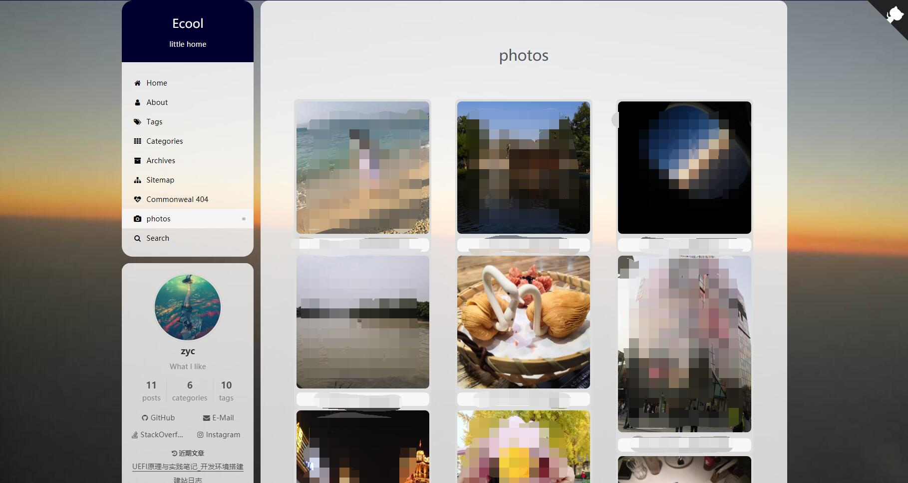

# hexo-next-photos

## what is it

- This package achieves a waterfall album page for Hexo Next theme.

- Example: my blog: [https://jygzyc.github.io/photos](https://jygzyc.github.io/photos)

  
## How to use

### install

- do `npm install hexo-next-photos --save` command
- then you need to change your theme layout file and add the following content to that file depended on your render system

### body-end.swig

- You should insert the following code into `/source/_data/body-end.swig`  

```swig

  <script src="/js/photo.js"></script>

```

### styles.styl

- You should insert the following code into `/source/_data/styles.styl`

```styl
//album style
.ImageGrid {
  width: 100%;
  max-width:1040px;
  margin: 0 auto;
  text-align: center;
  column-count: 1;
  column-gap: 0;
}
@media (min-width: 500px) {
    .ImageGrid {
        column-count: 2; // two columns on larger phones
    }
    .card {
        break-inside: avoid;
        box-sizing: border-box;
        padding: 4px;
        border-radius: 8px;
        background-color: #ddd;
    }
}
@media (min-width: 800px) {
    .ImageGrid {
        column-count: 3; // two columns on larger phones
    }
    .card {
        break-inside: avoid;
        box-sizing: border-box;
        padding: 4px;
        border-radius: 8px;
        background-color: #ddd;
    }

}
.card {
  break-inside: avoid;
  box-sizing: border-box;
  margin: 0 auto;
  padding: 4px;
  border-radius: 8px;
  background-color: #ddd;
}

.ImageInCard img {
  padding: 0 0 0 0;
  border-radius: 8px;
}
.TextInCard {
  background-color: rgba(255, 255, 255, 0.8);
  font-size: 70%;
  border-radius: 8px;
}
```

### _config.yml

- Add these config below to your _config.yml file(which under your blog root directory), and chang your URL

```yml
# hexo-next-photos
hexo_next_photos:
    thumbnailUrl: # thumbnail url
    photoUrl: # photos url
    photoDir: 
```


### next.yml

- Change your theme _config.yml(which under your blog theme directory)

```yml
custom_file_path:
-  #bodyEnd: source/_data/body-end.swig
+  bodyEnd: source/_data/body-end.swig
-  #style: source/_data/styles.styl
+  style: source/_data/styles.styl
...

# ---------------------------------------------------------------
# Third Party Plugins & Services Settings
# See: https://theme-next.org/docs/third-party-services/
# You may need to install dependencies or set CDN URLs in `vendors`
# There are two different CDN providers by default:
#   - jsDelivr (cdn.jsdelivr.net), works everywhere even in China
#   - CDNJS (cdnjs.cloudflare.com), provided by cloudflare
# ---------------------------------------------------------------
- fancybox: false
+ fancybox: true
...
- lazyload: false
+ lazyload: true
...

vendors:
  # FancyBox
  # jquery: //cdn.jsdelivr.net/npm/jquery@3/dist/jquery.min.js
  # fancybox: //cdn.jsdelivr.net/gh/fancyapps/fancybox@3/dist/jquery.fancybox.min.js
  # fancybox_css: //cdn.jsdelivr.net/gh/fancyapps/fancybox@3/dist/jquery.fancybox.min.css
  jquery:
  fancybox:  # choose a faster CDN
  fancybox_css: # choose a faster CDN

  # Lazyload
  # lazyload: //cdn.jsdelivr.net/npm/lozad@1/dist/lozad.min.js
  # lazyload: //cdnjs.cloudflare.com/ajax/libs/lozad.js/1.9.0/lozad.min.js
  lazyload: # choose a faster CDN

```

### add a new page and open it
- create a photos' page `hexo new page photos`，create `/source/photos/index.md`, insert the following code:

```md
---
title: Photos
type: photos
---
<div class="ImageGrid"></div>
```

- insert the following code into your _config.yml file(which under your blog theme directory)

```yml
menu:
+ photos: /photos/ || camera
```

### put your photos

- create a new `originPhotos` folder under base dir
- put your photos

```txt
blog  
└───node_modules/
└───scaffolds/
│   ...
│   _config.yml
└───oringinPhotos/
│   │   Put your photos here, please keep your photos names same as your URL photos names
|   |   ...
|   package.json
|   ...
```

## Some questions

- The `thumbnailUrl` and `photoUrl` are now only support repos URL.

## TODO

- achieve the figure bed URL          ()
- achieve a flexible waterfall action ()


